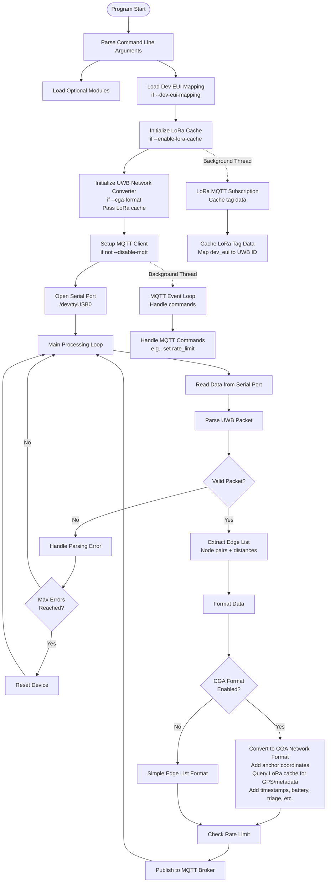
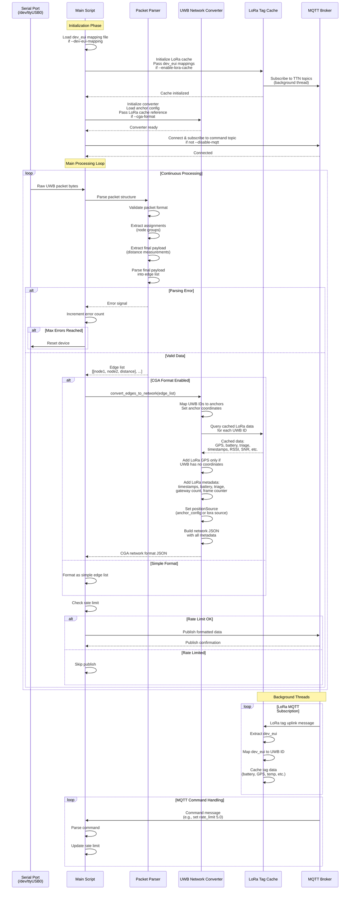
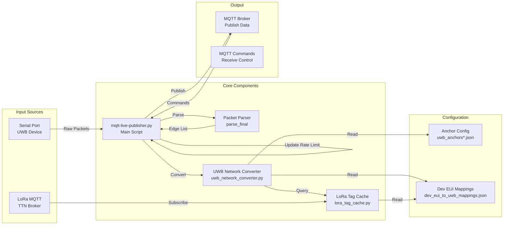
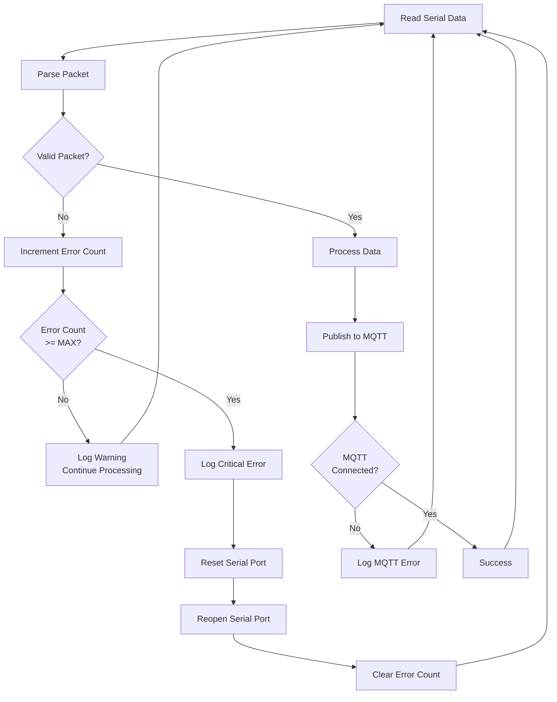
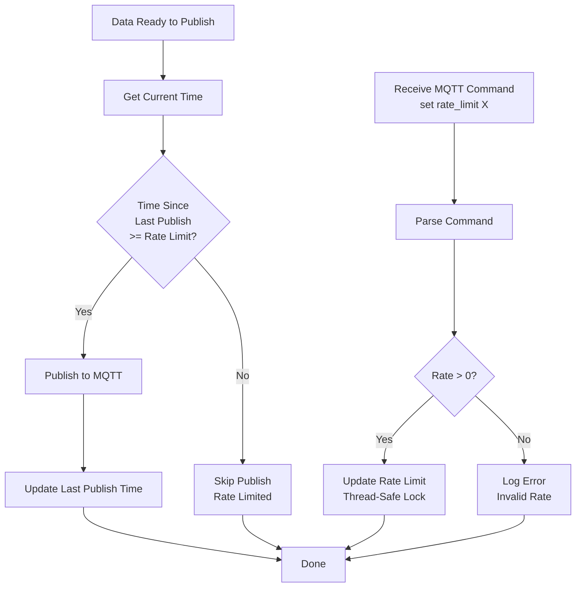

# UWB MQTT Publisher - Program Flow

This document describes the program flow of the UWB MQTT Publisher application using Mermaid diagrams.

## High-Level Architecture

## Detailed Data Flow

## Component Interaction Diagram

## Error Handling Flow

## Configuration Loading Flow

## Rate Limiting Flow

## Data Format Conversion

```mermaid
graph LR
    RawPacket["Raw UWB Packet<br/>Binary Data"] --> Parse["Parse Packet"]
    Parse --> EdgeList["Edge List Format<br/>node1, node2, distance"]
    
    EdgeList --> CheckFormat{Format Type?}
    
    CheckFormat -->|Simple| SimpleJSON["Simple JSON<br/>Array of edges"]
    CheckFormat -->|CGA| CGAConversion["CGA Conversion"]
    
    CGAConversion --> AddAnchors["Add Anchor Coordinates<br/>from config<br/>Set positionSource=anchor_config"]
    AddAnchors --> QueryLoRa["Query LoRa Cache<br/>for each UWB ID"]
    QueryLoRa --> CheckCoords{UWB has<br/>coordinates?}
    CheckCoords -->|No| AddLoRaGPS["Add LoRa GPS Coordinates<br/>Update lastPositionUpdateTime"]
    CheckCoords -->|Yes| KeepAnchorCoords["Keep Anchor Coordinates<br/>Don't override"]
    AddLoRaGPS --> AddLoRaMetadata["Add LoRa Metadata:<br/>timestamps, battery, triage,<br/>RSSI, SNR, gateway count, etc."]
    KeepAnchorCoords --> AddLoRaMetadata
    AddLoRaMetadata --> SetPositionSource["Set positionSource<br/>and positionAccuracy"]
    SetPositionSource --> CGANetwork["CGA Network Format<br/>Structured JSON<br/>with all metadata"]
    
    SimpleJSON --> MQTT["MQTT Publish"]
    CGANetwork --> MQTT
```

## Future Enhancements

This section documents potential future improvements to the UWB MQTT Publisher system, along with the rationale for each enhancement.

### Data Quality & Staleness Management

**Enhancement**: Add configurable data staleness thresholds and automatic filtering
- **Why**: Currently, LoRa cached data has timestamps but no automatic filtering based on age. Old GPS coordinates or sensor data could be misleading.
- **Implementation**: 
  - Add `--lora-max-age` parameter (seconds) to filter out stale LoRa data
  - Add `--lora-gps-max-age` parameter specifically for GPS coordinates
  - Log warnings when using stale data
  - Optionally exclude stale data from CGA format output
- **Benefits**: Prevents using outdated location data, improves data quality, reduces false positioning

### Cache Expiration & Cleanup

**Enhancement**: Implement automatic cache expiration for LoRa data
- **Why**: Currently, LoRa cache stores data indefinitely. Old entries could consume memory and provide stale information.
- **Implementation**:
  - Add TTL (Time To Live) for cached entries
  - Periodic cleanup thread to remove expired entries
  - Configurable expiration times per data type (GPS vs sensor data)
- **Benefits**: Memory efficiency, ensures only recent data is used, prevents stale data issues

### Position Confidence Scoring

**Enhancement**: Add confidence scores for position data
- **Why**: Different position sources (anchor config, LoRa GPS) have different reliability. A confidence score would help downstream systems make decisions.
- **Implementation**:
  - Calculate confidence based on: data age, GPS accuracy, number of gateways, RSSI/SNR
  - Add `positionConfidence` field (0.0-1.0) to CGA format
  - Higher confidence for anchors, lower for old/stale LoRa GPS
- **Benefits**: Enables intelligent decision-making in positioning systems, improves reliability assessment

### Multi-Source Position Fusion

**Enhancement**: Combine multiple position sources (anchor config + LoRa GPS) with weighted averaging
- **Why**: Currently, anchor positions take precedence. In some cases, combining anchor and LoRa GPS could provide better accuracy.
- **Implementation**:
  - Weighted average of anchor and LoRa GPS positions
  - Weights based on confidence, accuracy, and data age
  - Configurable fusion strategy (prefer anchor, prefer LoRa, or weighted)
- **Benefits**: Improved positioning accuracy, better use of available data sources

### Enhanced Error Recovery

**Enhancement**: Improve error handling and recovery mechanisms
- **Why**: Current error handling resets device after max errors, but could be more sophisticated.
- **Implementation**:
  - Exponential backoff for device resets
  - Different error thresholds for different error types
  - Automatic retry with different serial port settings
  - Health monitoring and reporting
- **Benefits**: More robust operation, reduced downtime, better diagnostics

### Data Validation & Sanity Checks

**Enhancement**: Add validation for UWB distance measurements and LoRa data
- **Why**: Invalid or impossible measurements (e.g., negative distances, GPS coordinates outside valid range) should be filtered.
- **Implementation**:
  - Validate UWB distances are within expected range
  - Validate GPS coordinates are reasonable (not 0,0 or extreme values)
  - Validate battery levels, temperatures are within expected ranges
  - Configurable validation rules
- **Benefits**: Prevents bad data from propagating, improves system reliability

### Statistics & Monitoring

**Enhancement**: Add comprehensive statistics and monitoring
- **Why**: Understanding system performance, data quality, and issues requires visibility.
- **Implementation**:
  - Track packet parsing success rate
  - Track LoRa cache hit/miss rates
  - Track data staleness statistics
  - Track MQTT publish success/failure rates
  - Periodic statistics reporting via MQTT or log
- **Benefits**: Better observability, easier troubleshooting, performance optimization

### Configurable Data Filtering

**Enhancement**: Allow filtering of UWB edges based on distance, quality, or other criteria
- **Why**: Some distance measurements may be unreliable (too long, too short, poor signal quality).
- **Implementation**:
  - Add `--max-distance` and `--min-distance` filters
  - Filter based on signal quality if available
  - Filter based on measurement confidence
- **Benefits**: Improved data quality, reduced noise in positioning calculations

### Historical Data Tracking

**Enhancement**: Maintain historical position and sensor data for trend analysis
- **Why**: Tracking position changes over time could enable velocity calculation, path prediction, and anomaly detection.
- **Implementation**:
  - Maintain sliding window of recent positions
  - Calculate velocity and acceleration
  - Detect sudden position jumps (potential errors)
  - Optional historical data export
- **Benefits**: Enables advanced features like velocity tracking, path prediction, anomaly detection

### Multi-Broker Support

**Enhancement**: Support publishing to multiple MQTT brokers simultaneously
- **Why**: Some deployments may need to publish to multiple systems (monitoring, analytics, control systems).
- **Implementation**:
  - Allow multiple `--mqtt-broker` arguments
  - Separate configuration per broker (topic, credentials, etc.)
  - Independent rate limiting per broker
- **Benefits**: Flexibility in deployment, supports multiple downstream systems

### Protocol Buffers or MessagePack Support

**Enhancement**: Add binary serialization formats as alternatives to JSON
- **Why**: JSON is human-readable but verbose. Binary formats reduce bandwidth and improve performance.
- **Implementation**:
  - Add `--format` option (json, protobuf, msgpack)
  - Define protobuf schema for CGA network format
  - Maintain JSON as default for compatibility
- **Benefits**: Reduced bandwidth, improved performance, smaller message sizes

### WebSocket Support for MQTT

**Enhancement**: Add WebSocket transport option for MQTT
- **Why**: Some network environments may require WebSocket instead of raw TCP for MQTT.
- **Implementation**:
  - Add `--mqtt-transport` option (tcp, websockets)
  - Support WebSocket URL format
- **Benefits**: Better compatibility with firewalls and proxies, supports web-based deployments

### Dynamic Anchor Configuration

**Enhancement**: Support updating anchor configuration at runtime via MQTT commands
- **Why**: Anchor positions may need to be updated without restarting the service.
- **Implementation**:
  - MQTT command: `update_anchor_config <json>`
  - Reload anchor configuration from file or MQTT payload
  - Validate new configuration before applying
- **Benefits**: Operational flexibility, no downtime for config changes

### Device Health Monitoring

**Enhancement**: Monitor and report device health metrics
- **Why**: Proactive monitoring can detect issues before they cause failures.
- **Implementation**:
  - Track serial port errors, connection status
  - Monitor LoRa cache connectivity
  - Track MQTT connection stability
  - Periodic health status reports
- **Benefits**: Early problem detection, improved reliability, easier maintenance

