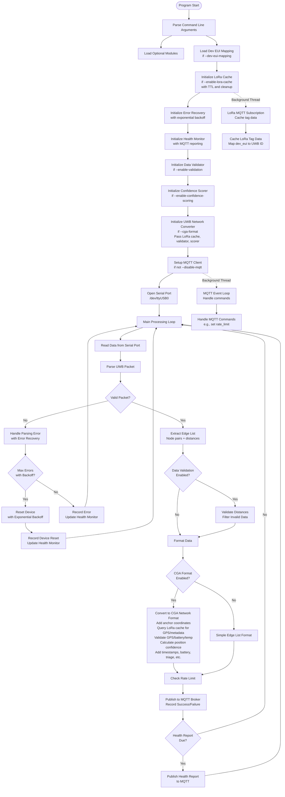
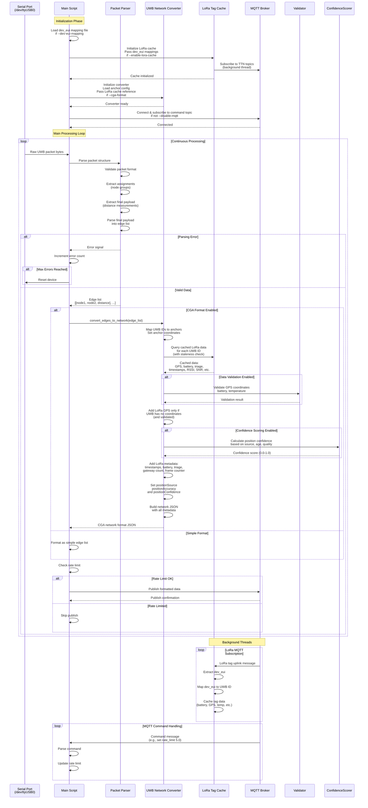
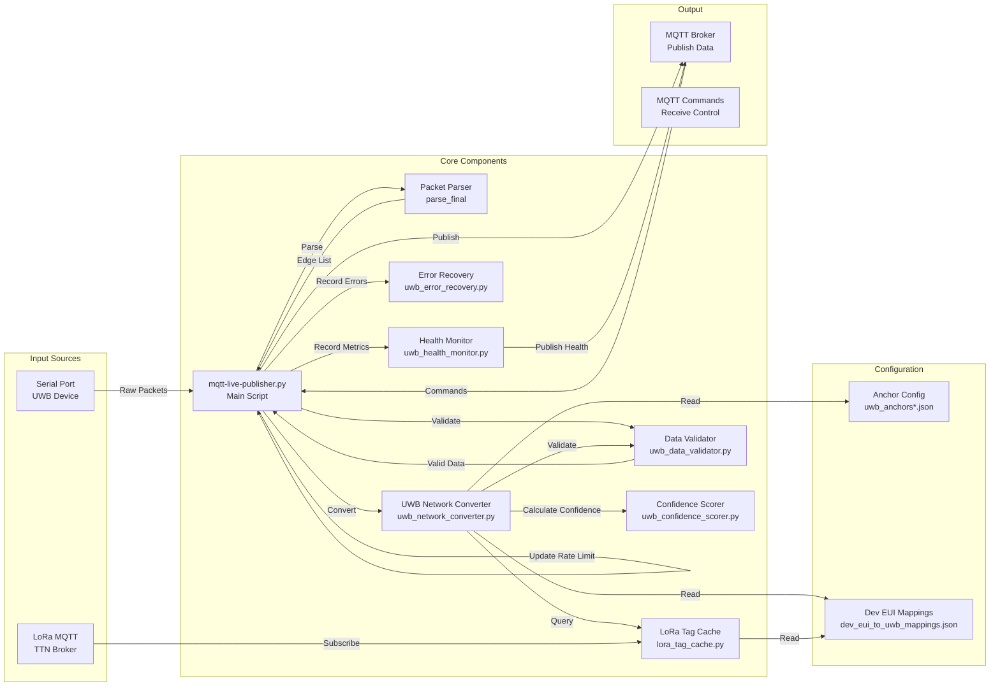
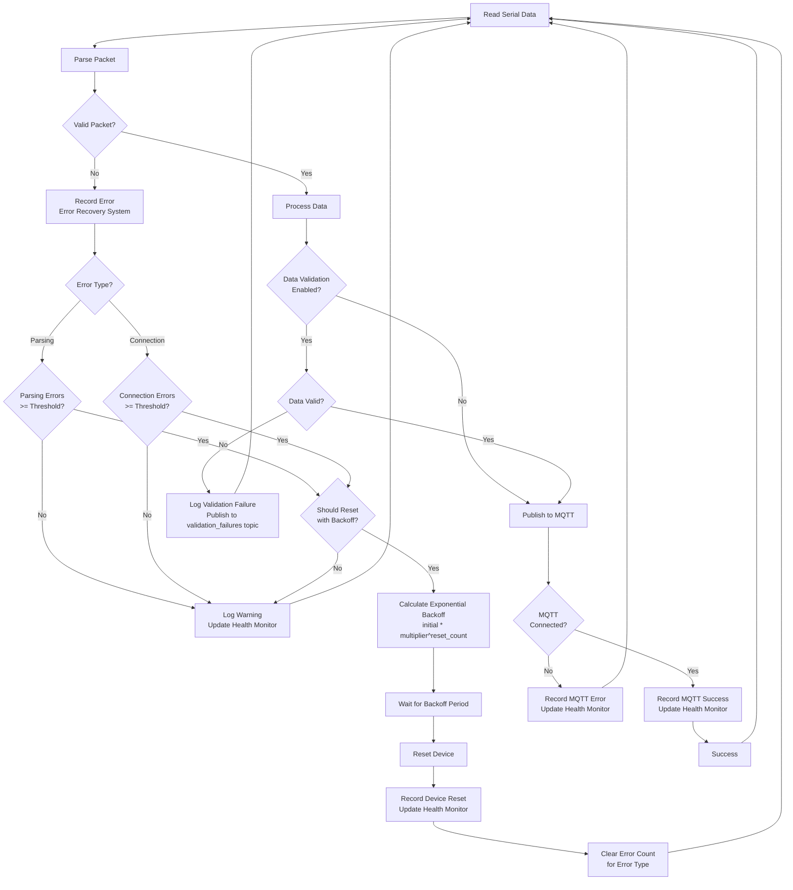
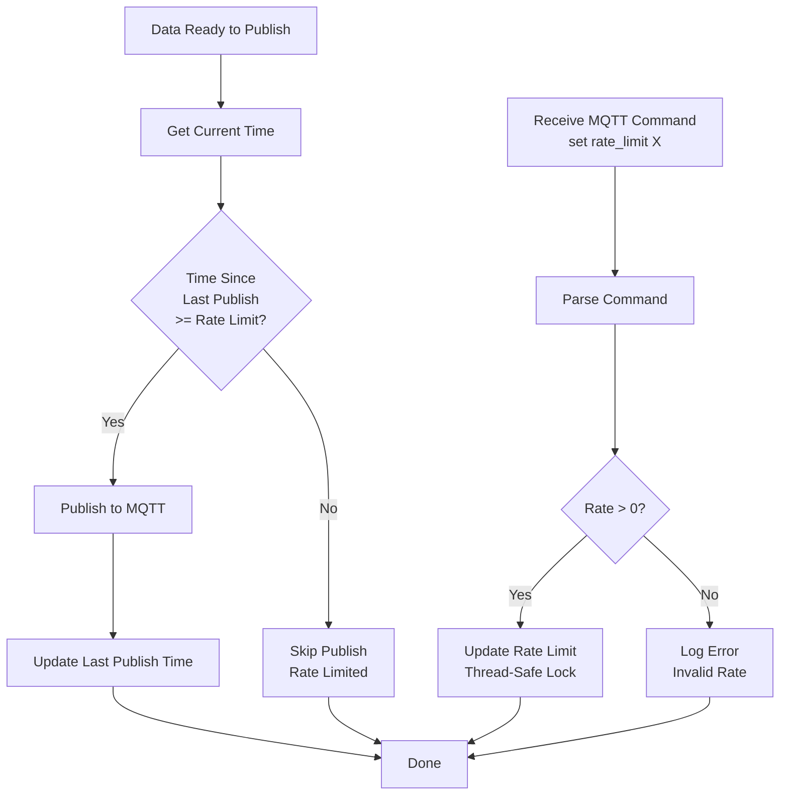

# UWB MQTT Publisher - Program Flow

This document describes the program flow of the UWB MQTT Publisher application using Mermaid diagrams.

## High-Level Architecture

## Detailed Data Flow

## Component Interaction Diagram

## Error Handling Flow

## Configuration Loading Flow

## Rate Limiting Flow

## Data Format Conversion

```mermaid
graph LR
    RawPacket["Raw UWB Packet<br/>Binary Data"] --> Parse["Parse Packet"]
    Parse --> EdgeList["Edge List Format<br/>node1, node2, distance"]
    
    EdgeList --> CheckFormat{Format Type?}
    
    CheckFormat -->|Simple| SimpleJSON["Simple JSON<br/>Array of edges"]
    CheckFormat -->|CGA| CGAConversion["CGA Conversion"]
    
    CGAConversion --> AddAnchors["Add Anchor Coordinates<br/>from config<br/>Set positionSource=anchor_config"]
    AddAnchors --> QueryLoRa["Query LoRa Cache<br/>for each UWB ID<br/>(with staleness check)"]
    QueryLoRa --> CheckCoords{UWB has<br/>coordinates?}
    CheckCoords -->|No| ValidateLoRaGPS["Validate LoRa GPS<br/>if validator enabled<br/>(reject 0,0, check ranges)"]
    CheckCoords -->|Yes| KeepAnchorCoords["Keep Anchor Coordinates<br/>Don't override"]
    ValidateLoRaGPS --> ValidateLoRaData["Validate LoRa Data<br/>battery, temperature<br/>if validator enabled"]
    ValidateLoRaData --> AddLoRaGPS["Add LoRa GPS Coordinates<br/>Update lastPositionUpdateTime"]
    AddLoRaGPS --> CalculateConfidence["Calculate Position Confidence<br/>if scorer enabled<br/>(anchor: 1.0, LoRa: 0.3-0.7)"]
    KeepAnchorCoords --> CalculateConfidence
    CalculateConfidence --> AddLoRaMetadata["Add LoRa Metadata:<br/>timestamps, battery, triage,<br/>RSSI, SNR, gateway count, etc."]
    AddLoRaMetadata --> SetPositionSource["Set positionSource<br/>positionAccuracy<br/>and positionConfidence"]
    SetPositionSource --> CGANetwork["CGA Network Format<br/>Structured JSON<br/>with all metadata"]
    
    SimpleJSON --> MQTT["MQTT Publish"]
    CGANetwork --> MQTT
```

## Future Enhancements

For detailed information about planned future enhancements, prioritized by importance and impact, see [FUTURE_ENHANCEMENTS.md](FUTURE_ENHANCEMENTS.md).

The enhancements are organized into 5 priority levels:
1. **Priority 1**: Critical for Production Reliability (Data staleness, cache expiration, error recovery)
2. **Priority 2**: Important for Data Quality (Data validation, confidence scoring)
3. **Priority 3**: Useful Features (Statistics, data filtering)
4. **Priority 4**: Advanced Features (Position fusion, historical tracking)
5. **Priority 5**: Nice to Have (Dynamic config, multi-broker, binary formats)

An implementation roadmap is provided in the FUTURE_ENHANCEMENTS.md file.

