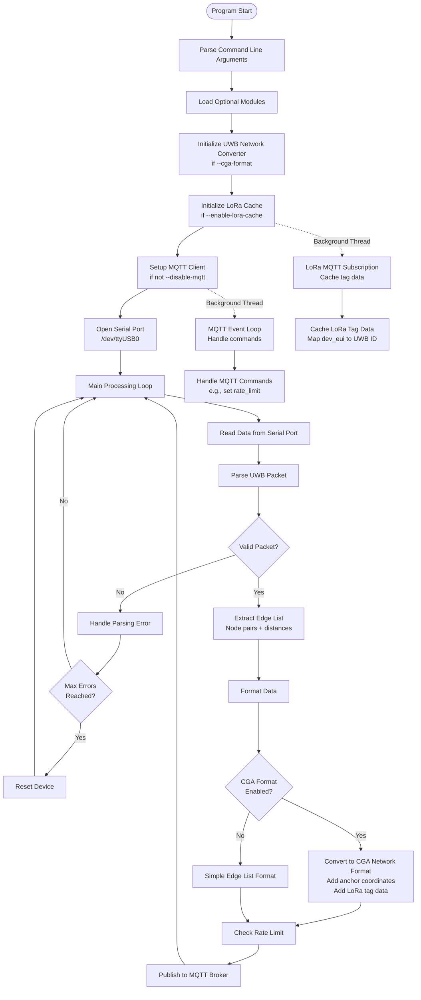
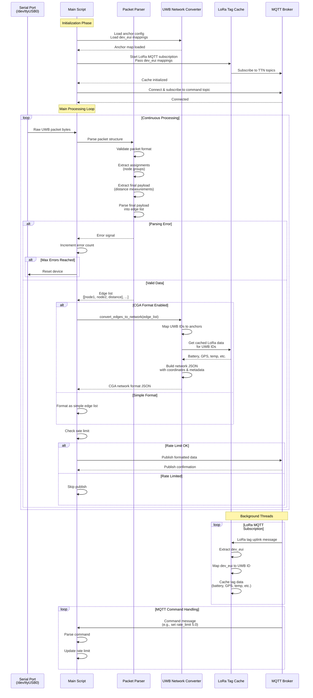
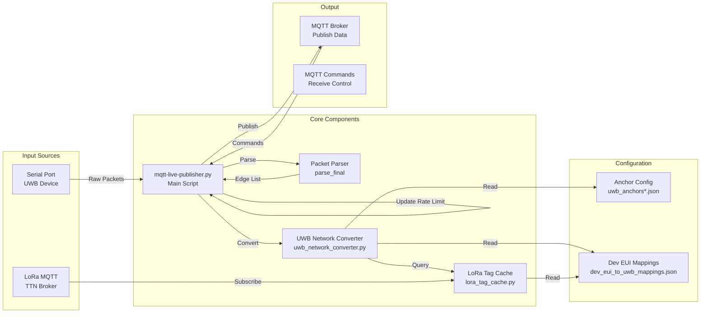
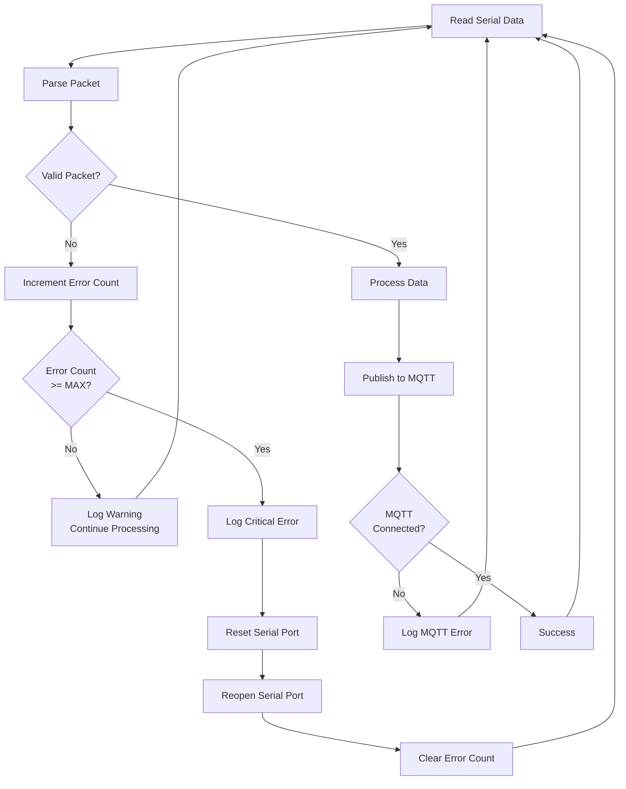
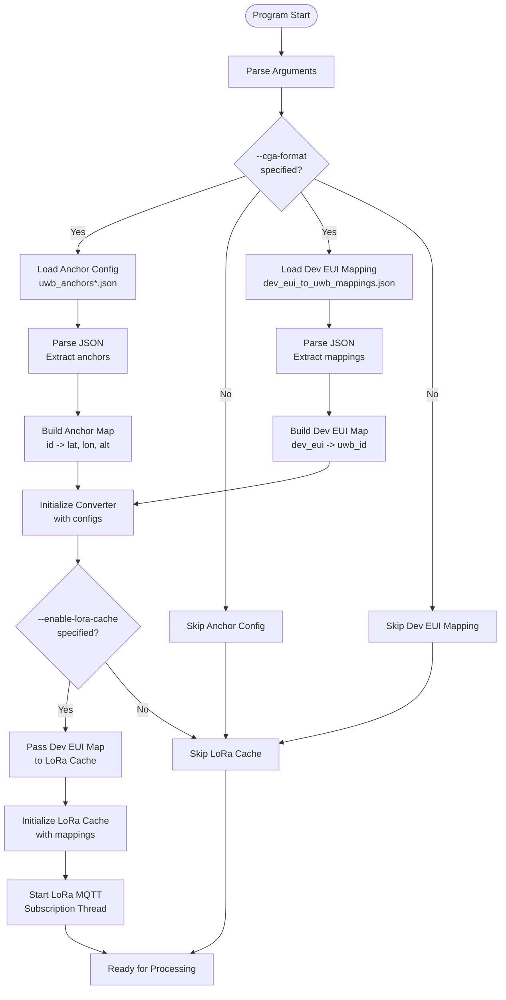
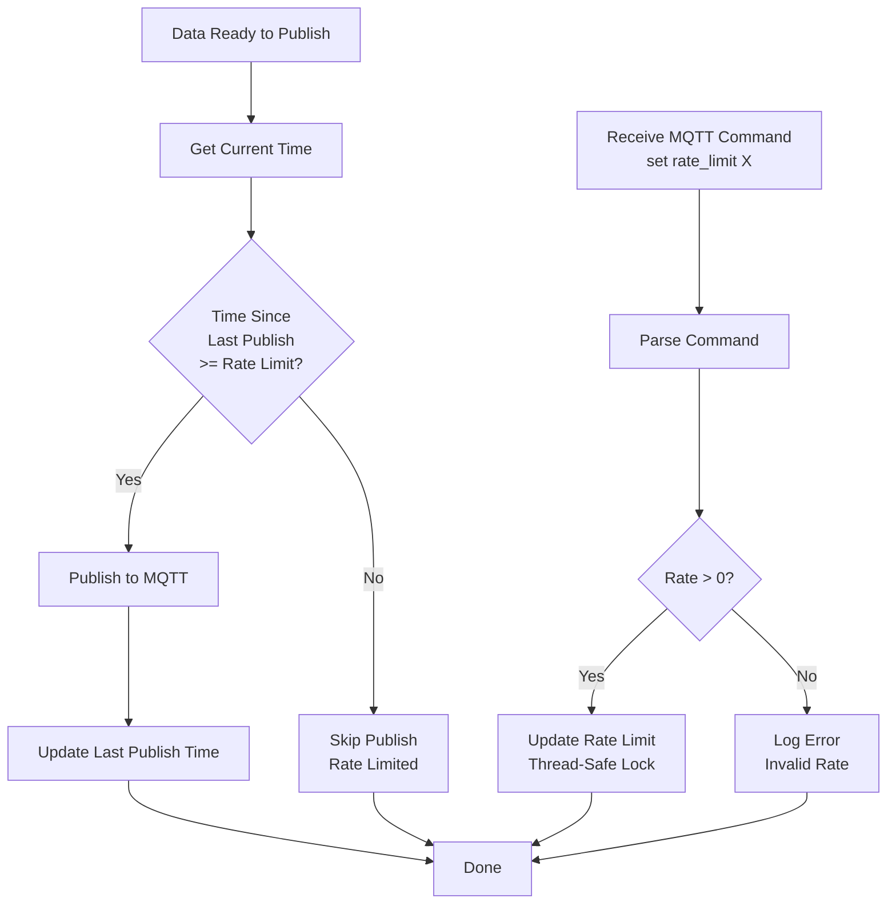

# UWB MQTT Publisher - Program Flow

This document describes the program flow of the UWB MQTT Publisher application using Mermaid diagrams.

## High-Level Architecture



## Detailed Data Flow



## Component Interaction Diagram



## Error Handling Flow



## Configuration Loading Flow



## Rate Limiting Flow



## Data Format Conversion

```mermaid
graph LR
    RawPacket[Raw UWB Packet<br/>Binary Data] --> Parse[Parse Packet]
    Parse --> EdgeList[Edge List Format<br/>[node1, node2, distance]]
    
    EdgeList --> CheckFormat{Format Type?}
    
    CheckFormat -->|Simple| SimpleJSON[Simple JSON<br/>Array of edges]
    CheckFormat -->|CGA| CGAConversion[CGA Conversion]
    
    CGAConversion --> AddAnchors[Add Anchor Coordinates<br/>from config]
    AddAnchors --> AddLoRaData[Add LoRa Tag Data<br/>from cache]
    AddLoRaData --> AddMetadata[Add Metadata<br/>timestamp, etc.]
    AddMetadata --> CGANetwork[CGA Network Format<br/>Structured JSON]
    
    SimpleJSON --> MQTT[MQTT Publish]
    CGANetwork --> MQTT
```

